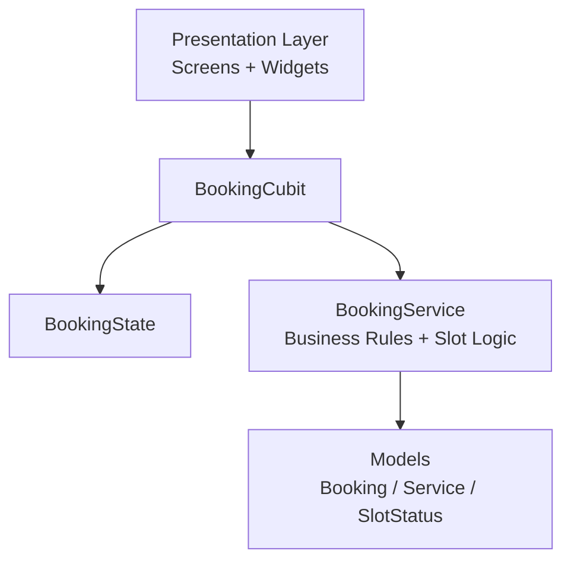
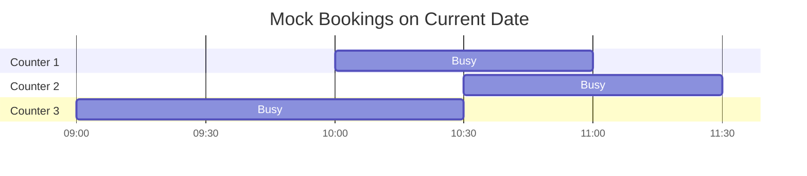

<p align="center">
	
</p>

<h2 align="center">OmniBook: Multi-Counter Service Booking System</h2>

*Service-based business (take saloon) that manages appointments across 
multiple independent service counters.*

<div align="center">

[](https://drive.google.com/drive/folders/1PJcLKp49UNXe2uAF8pMkmUvxZ1eYHnGW?usp=sharing)
[](https://drive.google.com/drive/folders/1kCdDArDWGWe4pbXP00RJIm1djwP2nd9i?usp=sharing)

</div>


---

## About The App

OmniBook is a Flutter-based booking application designed for businesses that run multiple service counters at the same time.

The app helps users:

- Select services and calculate total duration and price
- See real-time-like slot availability
- Understand how many counters are free per slot
- Choose a counter before final booking confirmation

---

## Tech Stack

- Flutter (Dart)
- State Management: flutter_bloc / bloc
- Equality utilities: equatable
- SVG rendering: flutter_svg
- UI/UX assets: custom SVG + custom font

---

## Architecture Overview

This project follows a feature-first layered structure with Cubit-based state management.



### Folder Direction

- `lib/features/presentation/`: screens, widgets, theme, UI utilities
- `lib/features/cubit/`: booking state and business interaction layer
- `lib/features/services/`: slot and counter availability logic
- `lib/features/models/`: domain entities and data models

---

## Core Features

- Multi-service selection with dynamic total duration and price
- Date-aware slot generation
- Counter availability check per slot
- Dynamic disabling (grey out) for invalid slots without continuous gap
- Counter selection before confirmation
- Booking confirmation summary
- Asset-driven UI (SVG icons, splash logo, custom font)

---

## How Multi-Counter Availability Is Solved

Availability is computed in `BookingService` with a simple but reliable per-counter check:

1. For a candidate start slot and selected total duration, the app first validates business-hour boundaries.
2. It then checks each counter independently (1 to 3).
3. For each counter, it tests overlap against that counter's existing bookings only.
4. Any counter with no overlap for the full requested duration is marked free.
5. The slot is enabled when the free-counter list is not empty; otherwise it is greyed out.

```dart
List<int> findFreeCounters(DateTime start, int duration) {
	if (!isWithinBusinessHours(start, duration)) {
		return <int>[];
	}

	final freeCounters = <int>[];
	for (var counterId = 1; counterId <= totalCounters; counterId++) {
		if (isCounterFree(counterId, start, duration)) {
			freeCounters.add(counterId);
		}
	}
	return freeCounters;
}

SlotStatus checkSlot(DateTime start, int duration) {
	final freeCounters = findFreeCounters(start, duration);
	return SlotStatus(
		isAvailable: freeCounters.isNotEmpty,
		freeCounters: freeCounters,
	);
}
```

This ensures users only see slots where at least one counter can serve the entire service window continuously, not just the first part of it.

---

## Mock Data And Booking Logic (Current Date)

The project currently uses in-memory mock data to simulate a real salon/barber workflow.

### 1. Sample Service Catalog

Source: `lib/features/presentation/data/sample_services.dart`

| Service | Duration (mins) | Price |
| --- | ---: | ---: |
| Quick Trim | 15 | 20 |
| Haircut & Style | 45 | 50 |
| Full Grooming | 90 | 120 |
| Beard Trim | 20 | 15 |

### 2. Current-Date Mock Bookings

Source: `lib/features/services/booking_service.dart`

All mock bookings are generated for the current date using `DateTime.now()`.

| Counter | Booked From | Booked To |
| --- | --- | --- |
| Counter 1 | 10:00 | 11:00 |
| Counter 2 | 10:30 | 11:30 |
| Counter 3 | 09:00 | 10:30 |

### 3. Business Window And Slot Generation

- Business hours: `09:00` to `18:00`
- Slot interval: every `30 minutes`
- A slot is enabled only if at least one counter has a continuous free gap equal to selected total service duration.

### 4. Visual Timeline (Current Date)



### 5. Example Logic (Full Grooming = 90 mins)

| Candidate Start Slot | Free Counter(s) | Slot State |
| --- | --- | --- |
| 09:00 | 2 | Enabled |
| 09:30 | None | Greyed out |
| 10:00 | None | Greyed out |
| 10:30 | 3 | Enabled |

This is the same dynamic disabling logic used in the app: if no counter can provide a continuous duration window (for example 90 mins), that slot is disabled.

---

## Getting Started

### Prerequisites

- Flutter SDK (stable)
- Dart SDK (included with Flutter)

### Setup

1. Clone the repository
2. Install dependencies:

```bash
flutter pub get
```

3. Run the app:

```bash
flutter run
```

---

## AI Usage Disclosure

Used Figma Community for taking app UI design inspiration.

Claude was used for helping project planning, logic verification, and discussing architecture decisions.

For coding help, GitHub Copilot was used.

---

## Future Improvements

- Backend/API integration for live bookings
- Authentication and user profiles
- Push notifications and reminders
- Admin dashboard for counter scheduling
- Payment integration

---

## Thanks

Thanks for checking out this project. Love to do this.

By Souvik  
