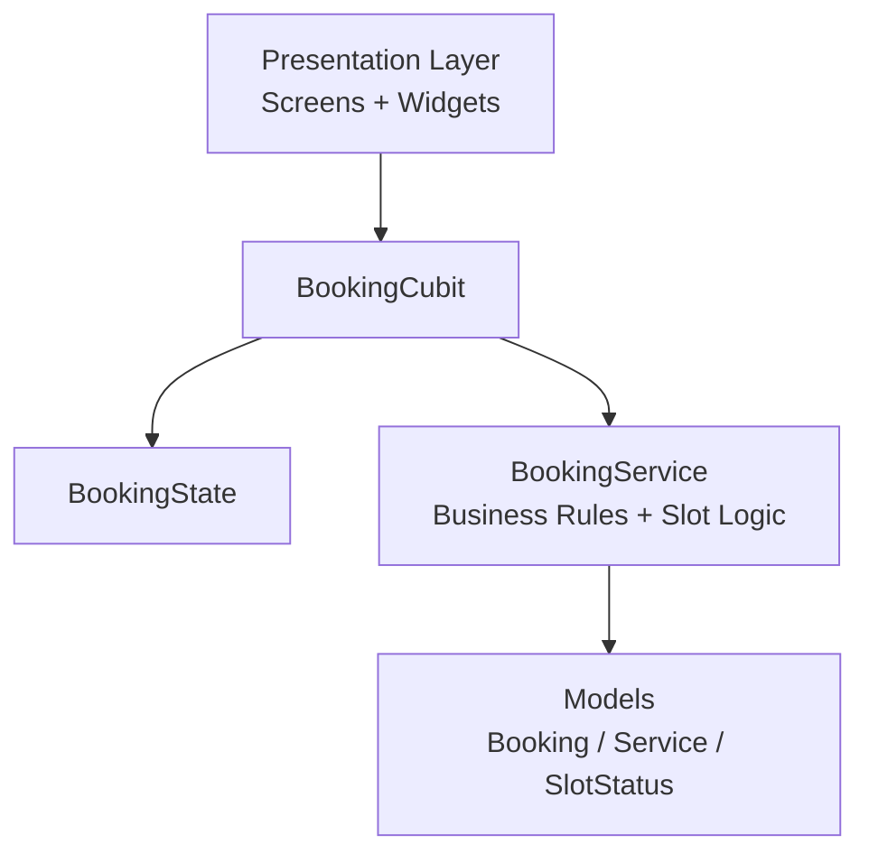

<p align="center">
	
</p>
<div align="center">

[](https://drive.google.com/drive/folders/1ALa4LMLRSNlo-AfE8aKxtOtkfFS7qBxy?usp=sharing)
[](https://drive.google.com/drive/folders/15wpaOKLergvQVzf40ISyQte0X5RydYxL?usp=sharing)

</div>


---

## About The App

OmniBook is a Flutter-based booking application designed for businesses that run multiple service counters at the same time.

The app helps users:

- Select services and calculate total duration and price
- See real-time-like slot availability
- Understand how many counters are free per slot
- Choose a counter before final booking confirmation

---

## Tech Stack

- Flutter (Dart)
- State Management: flutter_bloc / bloc
- Equality utilities: equatable
- SVG rendering: flutter_svg
- UI/UX assets: custom SVG + custom font

---

## Architecture Overview

This project follows a feature-first layered structure with Cubit-based state management.



### Folder Direction

- `lib/features/presentation/`: screens, widgets, theme, UI utilities
- `lib/features/cubit/`: booking state and business interaction layer
- `lib/features/services/`: slot and counter availability logic
- `lib/features/models/`: domain entities and data models

---

## Core Features

- Multi-service selection with dynamic total duration and price
- Date-aware slot generation
- Counter availability check per slot
- Dynamic disabling (grey out) for invalid slots without continuous gap
- Counter selection before confirmation
- Booking confirmation summary
- Asset-driven UI (SVG icons, splash logo, custom font)

---

## Getting Started

### Prerequisites

- Flutter SDK (stable)
- Dart SDK (included with Flutter)

### Setup

1. Clone the repository
2. Install dependencies:

```bash
flutter pub get
```

3. Run the app:

```bash
flutter run
```

---

## AI Usage Disclosure

Used Figma Community for taking app UI design inspiration.

Claude was used for helping project planning, logic verification, and discussing architecture decisions.

For coding help, GitHub Copilot was used.

---

## Future Improvements

- Backend/API integration for live bookings
- Authentication and user profiles
- Push notifications and reminders
- Admin dashboard for counter scheduling
- Payment integration

---

## Thanks

Thanks for checking out this project. Love to do this.

By Souvik  
